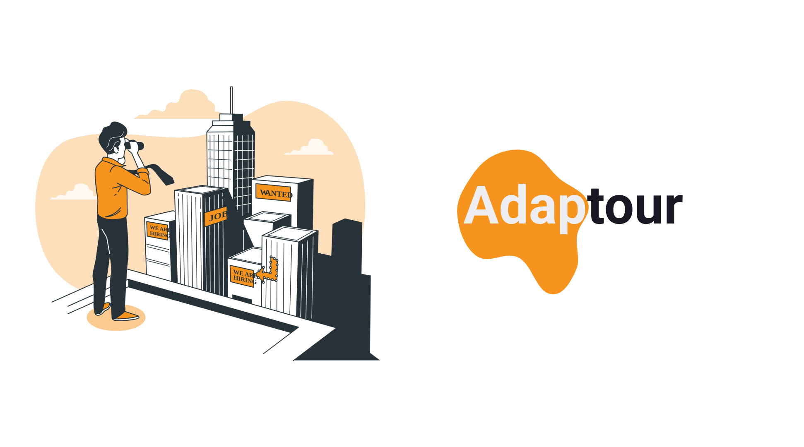
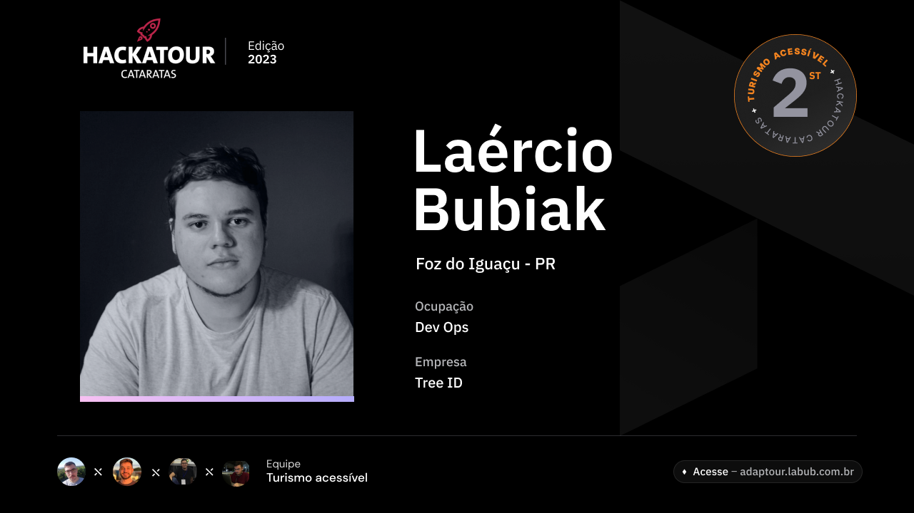
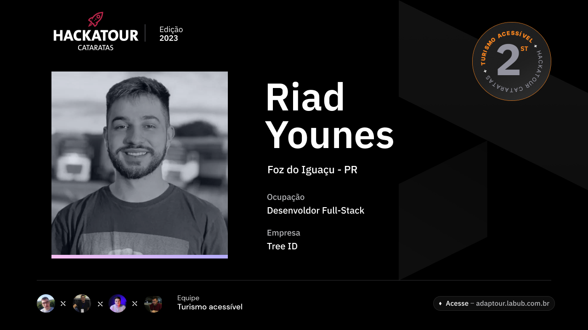
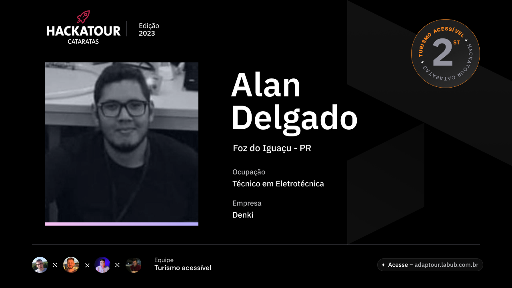
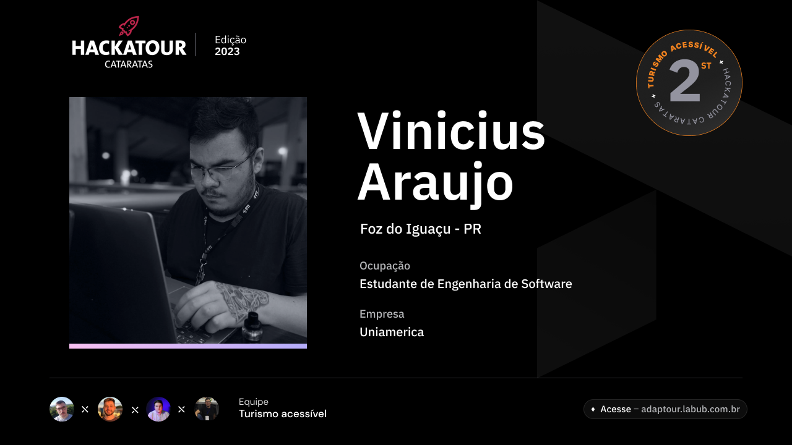

# Projeto Adaptour

> Adaptour é um projeto feito no Hackatour Cataratas 2023, Foz do iguaçu, Paraná.    
🥈2º Lugar na premiação geral.    
Projeto ajuda a solucionar a dor de um grupo de turistas aonde se precisam de acessbilidade.  
  Criando um roteiro de viagens aonde será possível a partir de um cadastro na plataforma indicar locais com as acessibilidades
  necessarias para o turista, e também promover o turismo acessivel para a cidade, gerando mais interesse de um grupo de turistas muito importantes.
 ## 🔨 Funcionalidades do projeto

- `Criar roteiros personalizados`: A principal funcionalidade do sistema é criar roteiros indicando e recomendando locais aonde se tem a acessbilidade necessária para o turista.
- `Turista`: O turista terá uma autonomia maior e uma melhor experiencia em suas viagens, evitando constrangimentos ou isolamento sociais por conta de alguma condição.
- `Comércio`: A partir do momento aonde a cidade se adapta e evolua para o acesso desse grupo de turistas, atraíra uma parcela consideravél de turistas que ficam mais tempo na cidade e consequentemente consomem mais, gerando maior fluxo de caixa para os comerciantes locais.
### Ajustes e melhorias

Temos um MVP no figma e também sua lading page em: adaptour.labub.com.br 
 
Essas serão as proximas melhorias a serem feitas
- [x] Criar lading page
- [ ] Começar a montar o back-end
- [ ] Crianção do fluxo MER E DER.

## 🤝 Colaboradores

Agradecemos às seguintes pessoas que contribuíram para este projeto:

<table>
  <tr>
    <td align="center">
      <a href="https://www.linkedin.com/in/laercio-bubiak/" taret="blank">
         
        
        
      </a>
    </td>
    <td align="center">
      <a href="https://www.linkedin.com/in/dionbiancha/" target="blank">
         
        
        
      </a>
    </td>
    </table>
    <table>
    <td align="center">
      <a href="https://www.linkedin.com/in/riad-younes-6a5348187/" target="blank">
         
        
        
      </a>
    </td>
    <td align="center">
      <a href="https://www.linkedin.com/in/alan-jbdn/" target="blank">
         
        
        
      </a>
    </td>
      </a>
    </td>
     <td align="center">
      <a href="https://www.linkedin.com/in/araujovx/" target="blank">
         
        
        
      </a>
</table>
